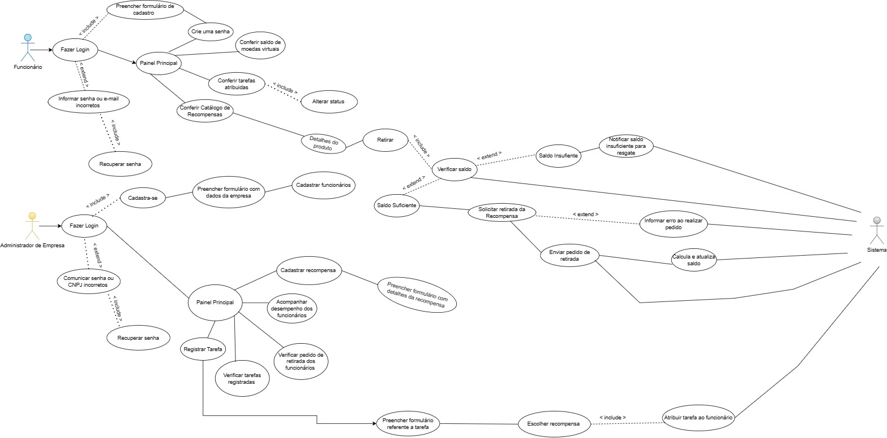
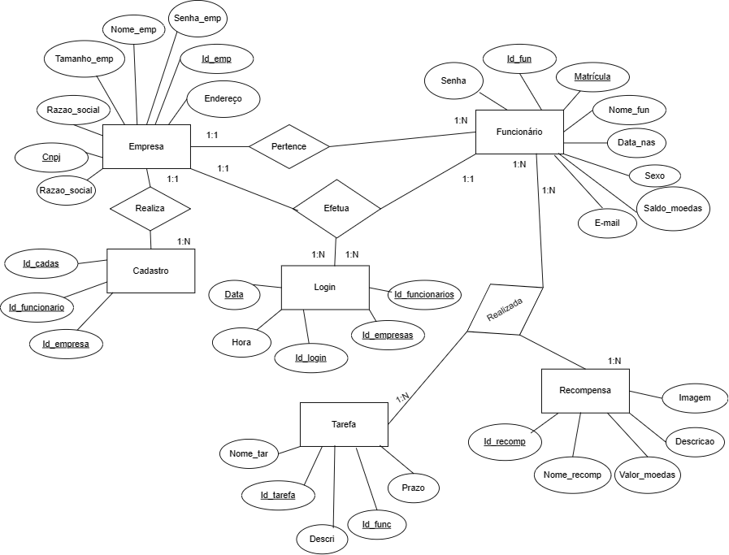

# Especificações do Projeto

Pré-requisitos: <a href="1-Documentação de Contexto.md"> Documentação de Contexto</a>

## Personas

### Persona 1: Agatha Martins

Agatha tem 39 anos. É empreendedora, sócia em uma corretora de investimentos.

**Desafios:** Comprometimento da performance da empresa, ao não conseguir organizar de forma objetiva as demandas e tarefas diárias.

**Objetivo:** Liderando uma empresa que busca agilidade e bom planejamento, Agatha procura uma forma de organização para que seus funcionários possam ter o controle claro de suas tarefas e se sintam motivados no modelo de autogerenciamento.

**Interesses:** Busca por uma solução que auxilie na gestão de atividades e que incentive os colaboradores a cumprirem as demandas.

 
### Persona 2: Gabriel Silva

Gabriel tem 27 anos. É empreendedor, proprietário de uma indústria de embalagens.

**Desafios:** Atraso nas entregas devido à falta de organização de demandas. Não conformidades motivadas por tarefas não realizadas.

**Objetivo:** Melhora no processo de gerenciamento, fazendo os funcionários ficarem mais engajados. Redução do número de não conformidades e atrasos na entrega de pedidos.

**Interesses:** Método de ajudar os colaboradores a organizarem as demandas e prioridades, além de facilitar no planejamento das tarefas do dia a dia.

## Histórias de Usuários

Com base na análise das personas forma identificadas as seguintes histórias de usuários:

|EU COMO... `PERSONA`| QUERO/PRECISO ... `FUNCIONALIDADE`                                          | PARA ... `MOTIVO/VALOR`                                 |
|--------------------|-----------------------------------------------------------------------------|---------------------------------------------------------|
| Agatha Martins     | Cadastrar tarefas a serem realizadas diariamente                            | Auxiliar na rotina sem esquecer tarefas                 |
| Agatha Martins     | Método de autogerenciamento para colaboradores                              | Proporcionar autonomia para os funcionários             |
| Agatha Martins     | Possibilitar colaboradores a adquirirem brindes de acordo com a performance | Mostrar reconhecimento e aumentar a motivação           |
| Gabriel Silva      | Visualizar as demandas de forma clara                                       | Auxiliar na rotina sem esquecer tarefas                 |
| Gabriel Silva      | Acompanhar prazos de atividades a serem realizadas                          | Para melhorar o planejamento                            |
| Gabriel Silva      | Recompensar colaboradores por cumprimento de tarefas                        | Aumentar a produtividade                                |
| Gabriel Silva      | Analisar tarefas realizadas fora do prazo determinado                       | Aplicar correção para melhoria no desempenho da empresa |

## Requisitos

As tabelas que se seguem apresentam os requisitos funcionais e não funcionais que detalham o escopo do projeto.

### Requisitos Funcionais

|ID    | Descrição do Requisito  | Prioridade |
|------|-----------------------------------------|----|
| RF-01 | Realizar cadastro/login na plataforma | Alta | 
| RF-02 | Recuperar senha | Alta |
| RF-03 | Cadastro de tarefas | Alta |
| RF-04 | Atribuir responsável para a tarefa cadastrada | Alta |
| RF-05 | Gerenciar valores de moedas virtuais as tarefas | Alta |
| RF-06 | Funcionário registra status de tarefa | Alta |
| RF-07 | Gestor válida status de tarefa | Alta |
| RF-08 | Atribuir recompensa a funcionários | Alta |
| RF-09 | Funcionário consulta recompensas disponíveis | Alta | 
| RF-10 | Funcionário adquire recompensas | Alta |

### Requisitos não Funcionais

|ID     | Descrição do Requisito  |Prioridade |
|-------|-------------------------|----|
| RNF-01 | O sistema deve ser capaz de lidar com um grande número de administradores registrando atividades simultâneas sem comprometer a velocidade e a responsividade | Alta |
| RNF-02 | Criar uma interface de usuário intuitiva e fácil de usar, minimizando a curva de aprendizado para os usuários | Alta |
| RNF-03 | Projetar o sistema de forma que ele possa ser escalado facilmente à medida que o número de usuários e atividades aumenta | Alta |
| RNF-04 | O sistema deve ser estável e confiável, minimizando o tempo de inatividade não planejado | Alta |
| RNF-05 | Permitir que as empresas personalizem as recompensas disponíveis de acordo com suas políticas e cultura | Média |
| RNF-06 | Facilitar a manutenção do sistema por meio de uma arquitetura bem organizada e documentação abrangente | Alta |
| RNF-07 | Ter a capacidade de realizar atualizações e melhorias regulares no sistema | Alta |
| RNF-08 | Garantir que o sistema possa ser integrado a sistemas de gestão de RH ou outras ferramentas que as empresas já utilizem | Alta |
| RNF-09 | Manter tempos de resposta curtos, especialmente durante a navegação na loja e ao visualizar detalhes das recompensas | Alta |
| RNF-10 | Possuir um mecanismo de busca eficiente permitindo que os usuários encontrem recompensas facilmente | Média |

## Restrições

O projeto está restrito pelos itens apresentados na tabela a seguir.

|ID| Restrição                                             |
|--|-------------------------------------------------------|
|RE-10| Orçamento Restrito - O projeto tem um orçamento limitado que não pode ser aumentado. Isso significa que a equipe de desenvolvimento deve trabalhar dentro das restrições orçamentárias definidas, o que pode afetar a escolha de tecnologias, recursos e escopo do projeto |
|RE-02| O projeto deve estar em conformidade com todas as regulamentações de privacidade de dados aplicáveis, como GDPR (Regulamento Geral de Proteção de Dados) ou leis locais de privacidade. Isso impõe restrições ao tratamento de dados pessoais dos funcionários e requer medidas rigorosas de proteção de dados |
|RE-03|  O projeto deve ser capaz de se integrar perfeitamente com os sistemas existentes de gerenciamento de recursos humanos (RH) das empresas clientes. Isso pode ser desafiador devido às diferentes tecnologias e infraestruturas utilizadas por essas empresas, impondo restrições à flexibilidade do sistema |

 
Enumere as restrições à sua solução. Lembre-se de que as restrições geralmente limitam a solução candidata.
## Diagrama de Casos de Uso 

Figura 1 - Diagrama de Casos de Uso - Descrição das funções e escopo do sistema. 

## Diagrama Entidade Relacionamento

Figura 2 - Diagrama MER - Descrição dos objetos do mundo real através de entidades, com suas propriedades e os seus relacionamentos. 

 
