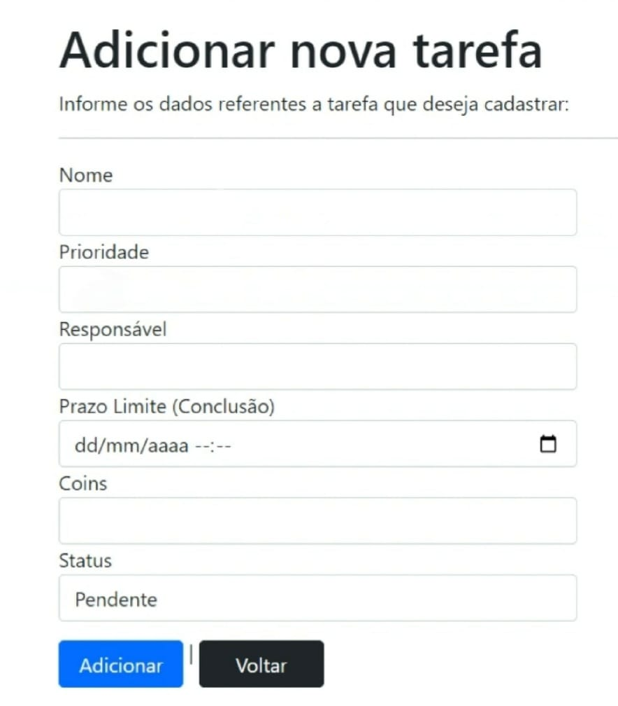

# Programação de Funcionalidades

<h2>7. Visão Geral das Funcionalidades do Sistema (Telas)</h2>

Nesta seção, você encontrará uma descrição detalhada das telas desenvolvidas para cada funcionalidade do sistema, juntamente com o respectivo endereço (URL) e instruções de acesso.

<h3>Gerenciamento de Tarefas e Valores de Moedas Virtuais (RF-03 e RF-05)</h3>

A tela principal do sistema exibe as tarefas cadastradas e atribuídas aos funcionários. Os dados dessas tarefas são armazenados usando estruturas de dados baseadas em SQL. A Figura 1 apresenta um exemplo desta tela.

Figura 1 - Tela para cadastro de tarefa. 

  

Requisitos atendidos:
 
● RF-03 - Cadastro de Tarefa. 
● RF-05 - Gerenciar valores de moedas virtuais as tarefas.

Artefatos da funcionalidade: 
● index.html  
● script_noticias.js  
● style.css  
● icone_noticia.jpg
  
<h3>Validação do Status da Tarefa pelo Gestor (RF-07)</h3>

A tela inicial permite ao gestor editar o status da tarefa visível.A Figura 2 apresenta um exemplo desta tela.

Figura 2 - Tela para visualizar, alterar ou excluir tarefa. 

  
Artefatos da funcionalidade: 
● pesquisa.html  
● script_pesquisa.js  
● style.css  
● icone_lupa.jpg  
 
Instruções de acesso: 
1. Faça o download do arquivo do projeto (ZIP) ou clone do projeto no GitHub; 
2. Descompacte o arquivo em uma pasta específica; 
3. Abra o Visual Studio Code e execute o Live Server;  
4. Abra um navegador de Internet e informe a seguinte URL:
http://localhost:7008/Tarefas
