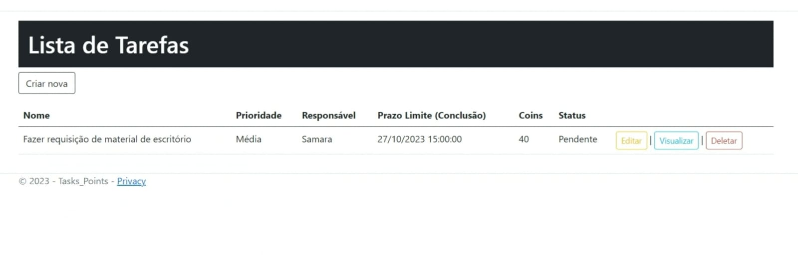

# Programação de Funcionalidades

<h2>Visão Geral das Funcionalidades do Sistema (Telas)</h2>

Nesta seção, você encontrará uma descrição detalhada das telas desenvolvidas para cada funcionalidade do sistema, juntamente com o respectivo endereço (URL) e instruções de acesso.

<h3>Gerenciamento de Tarefas e Valores de Moedas Virtuais (RF-03, RF-04 e RF-05)</h3>

A tela principal do sistema exibe as tarefas cadastradas pelo gestor e atribuídas aos funcionários. Além de informações como o grau de prioridade de uma tarefa, o prazo limute para conclusão e quantidade de coins a ser ganha. Os dados dessas tarefas são armazenados usando estruturas de dados baseadas em SQL. A Figura 1 apresenta a tela usada para adicionar uma nova tarefa.

Figura 1 - Tela para cadastro de tarefa. 

  

Requisitos atendidos:
 
● RF-03 - Cadastro de Tarefa. 
● RF-04 - Atribuir responsável para a tarefa cadastrada.
● RF-05 - Gerenciar valores de moedas virtuais as tarefas.

Artefatos da funcionalidade: 
● Tarefas/Create.cshtml
  
<h3>Validação do Status da Tarefa pelo Gestor e Registro de Status da Tarefa pelo Funcionário (RF-06 e RF-07)</h3>

A tela inicial permite ao gestor editar o status da tarefa visível e ao funcionário registrar o status daquela tarefa. Assim que concluída o funcionário seleciona a tarefa que deseja, aperta em editar e muda o status para "Concluída". A Figura 2 apresenta um exemplo desta tela.

Figura 2 - Tela para visualizar, alterar ou excluir tarefa. 

  

Requisitos atendidos:
 
● RF-06 - Funcionário registra status de tarefa. 
● RF-07 - Gestor válida status de tarefa.

Artefatos da funcionalidade: 
● Tarefas/Index.csthml  
● Tarefas/Create.cshtml  
● Tarefas/Edit.cshtml  
● Tarefas/Details.cshtml  
● Tarefas/Delete.cshtml  

<h3>Login/cadastro na plataforma (RF-01)</h3>

Logo de início ao entrar no site o usuário é direcionado a página de login, caso o funcionário/colaborador já tenha sido cadastrado basta informar o e-mail e a senha. Contudo, caso ainda não tenha cadastro seu gestor irá criar um novo usuário, apenas usuários com perfil admin podem criar outros usuários e visualizar a aba usuários da palataforma.

Figura 3 - Login na plataforma. 

  

Figura 4 - Tela para controle de usuários. 

  

Requisitos atendidos:
 
● RF-01 - Realizar cadastro/login na plataforma.

Artefatos da funcionalidade: 
● Usuarios/Index.csthml  
● Usuarios/Login.cshtml  
● Usuarios/AccessDenied.cshtml  
● Usuarios/Create.cshtml  
● Usuarios/Edit.cshtml  
● Usuarios/Delete.cshtml  
● Usuarios/Details.cshtml  

<h3>Consulta de Recompensas Disponíveis pelos Funcionários (RF-09)</h3>

A tela de Recompensas da aplicação permite que os funcionários consulte as recompensas disponíveis (previamente cadastradas pelo gestor). O funcionário pode visualizá-las, porém não pode editar, excluir ou criar uma nova. A figura 5 apresenta a página onde são visualizadas as recompensas.

Instruções de acesso: 
1. Faça o download do arquivo do projeto (ZIP) ou clone do projeto no GitHub; 
2. Descompacte o arquivo em uma pasta específica; 
3. Abra o Visual Studio Code e execute o Live Server;  
4. Abra um navegador de Internet e informe a seguinte URL:
http://localhost:7008/Tarefas
